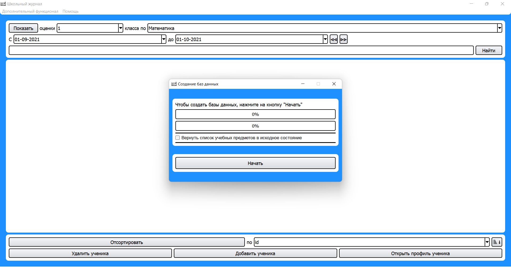
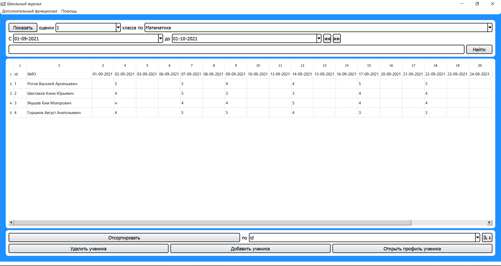
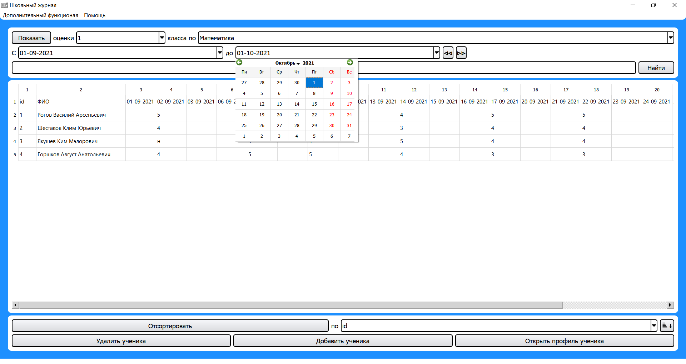
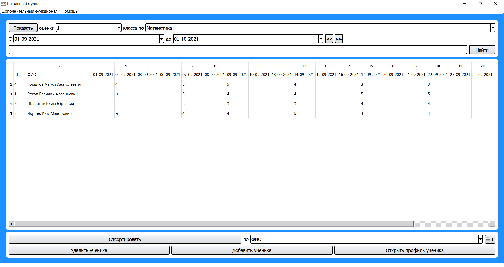
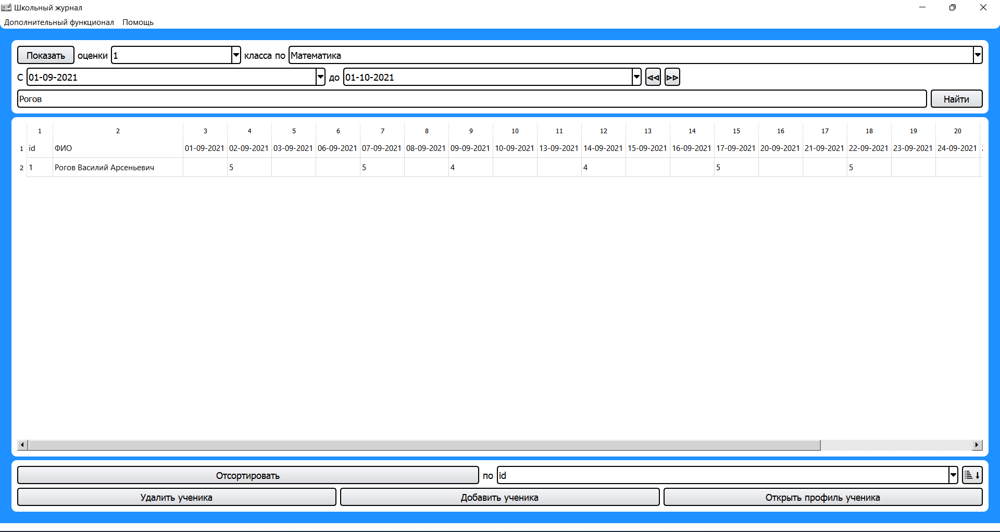
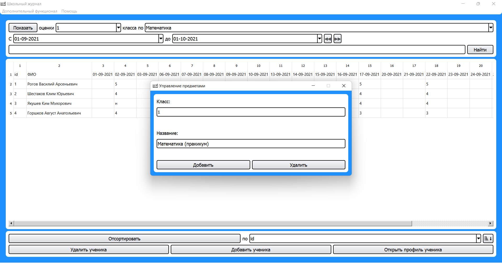
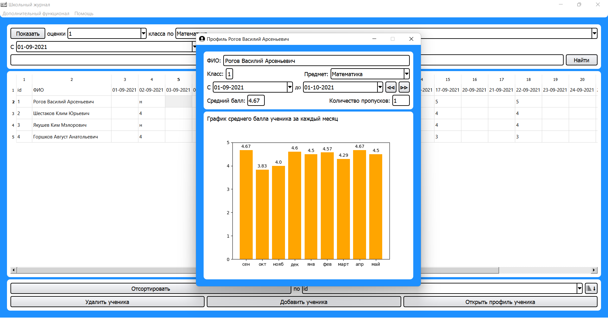
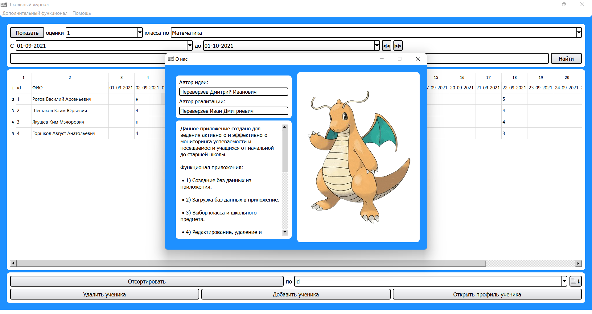

# Проект «Электронный журнал»

---

## Идея проекта

Уже сейчас специалистами создано множество программ для системы образования: 
электронные учебники, анимации, тестирующие программы, электронные дневники, 
журналы и пр. В моей школе тоже используется электронный журнал, применение 
которого одобрено в масштабах практически всей страны. Но его функционал не 
дает возможности графической обработки данных для отслеживания динамики успеваемости 
за короткие периоды времени, например, за месяц. Для компенсации этого недостатка, 
мною было принято решение разработать электронное приложение, которое позволило бы 
расширить возможности для анализа успеваемости и построения мониторинга образовательного процесса.

## Структура проекта

- Папки:
  - static — папка для хранения статического контента, например, изображений.
  - models — папка для хранения дополнительных модулей.
  - Designs — папка для хранения дизайнов окон.
  - Data_bases — папка для хранения баз данных.
- Файлы:
  - Электронный журнал.py — главный исполняемый файл.
  - requirements.txt — файл со списком всех библиотек, необходимых для запуска проекта в интерпретаторе,
    например в PyCharm`е.
  - subjects.json — файл, содержащий список учебных предметов.
  - Creating_db_1.py — файл для удобного создания баз данных.

## Структура главного файла

- Классы:
  - MainWindow — главного окна.
  - PupilForm — окна профиля ученика.
  - AddSubjectForm — окна управления школьными предметами.
  - AboutUsWindow — вспомогательного окна "О нас".
- Функции:
  - new_education_year — для нахождения текущего учебного года.
  - between_dates — для нахождения всех промежуточных дат между двумя заданными.

## Используемые библиотеки

- «PyQt5» – специальная библиотека для создания оконных приложений путем реализация каждого окна,
  как отдельного объекта.
- «PyQt5-tools» – ПО для удобной и быстрой разработки дизайна оконного приложения, созданного с помощью «PyQt5».
- «Sqlite3» – библиотека для создания, удаления и редактирования баз данных SQLite.
- «Matplotlib» – библиотека, используемая для создания 2D-графиков и графиков с использованием сценариев Python.
- «Numpy» – это фундаментальный пакет для научных вычислений на Python. Данная библиотека предназначена для
  хранения больших объемов информации, необходимой для корректной работы программы.
- «Os» – модуль, предназначенный для взаимодействия программы с операционной системой,
  в частности для управления файлами.
- «Json» – пакет для чтения и редактирования файлов формата «json».

## Функционал проекта

- Перейдя во вкладку «Дополнительный функционал» и нажав на кнопку «Создать базы данных», вы откроете окно,
  которое позволит вам создать базы данных прямиком из приложения. 
   
  *Примечание*: создавая новые базы данных, вы удаляете старые.
  
---

- Если вы нажмете на кнопку «Показать», вы загрузите таблицу из базы данных,
  соответствующую указанному классу и учебному предмету. 
   
  *Примечание*: загрузив таблицу, вы получаете возможность добавлять, удалять и редактировать ячейки таблицы. 
  Но при попытке ввода в ячейки, предназначенные для оценок, текста или чисел, не входящих в диапазон от 2 до 5,
  ничего не изменится (исключение – буква «н», означающая пропуск). То же самое произойдет при попытке изменить 
  первую строку или первый столбец таблицы. Удалить ученика(ов) из таблицы можно выделив его(их) строку(и) и 
  нажав на кнопку «Удалить ученика» или клавишу «Delete».
  
---

- Вы можете выбрать период, за который нужно показать информацию.  
  Примечание: изменить период можно и с помощью кнопок «ᐊᐊ» и «ᐅᐅ». Для обновления таблицы нажмите на кнопку «Показать».
  
---

- После загрузки таблицы, ее можно отсортировать. Сделать это можно нажав на кнопку «Отсортировать», предварительно
  выбрав ключ сортировки (всего их 3: идентификационный номер, ФИО и средний балл за весь учебный год). 
   
  *Примечание*: доступна сортировка как по возрастанию, так и по убыванию.
  
---

- Поиск всех учеников, чье ФИО содержит искомую строку. 
   
  *Примечание*: вы не можете добавлять учеников, находясь в режиме поиска. 
  Для того чтобы вернуться в режим редактирования, нажмите на «Показать».
  
---

- Перейдя во вкладку «Дополнительный функционал» и нажав на кнопку «Управление предметами», вы откроете окно,
  которое позволит вам добавлять или удалять учебные предметы для каждого класса. 
   
  *Примечание*: Список всех предметов для каждого класса можно вернуть в исходное состояние. Для этого поставьте соответствующую галочку при создании новых баз данных.
  
---

- Главная «фишка» данного проекта – открытие профиля ученика, в котором будет указана информация о его успеваемости.
   
  *Примечание*: в данном окне отображаются ФИО и класс ученика, а также средний балл и количество пропусков,
  соответствующие выбранным временному промежутку и учебному предмету. Открыть профиль ученика можно выделив 
  его строку в таблице и нажав на клавишу «O» на английской раскладке или нажав на соответствующую кнопку.
  
---

- Перейдя во вкладку «Помощь» и нажав на кнопку «О нас», вы откроете окно, рассказывающее об авторах данного проекта,
  а также о своих основных функциях. Естественно, в рамках конкурса проектов данные об авторах вырезаны. :)
  